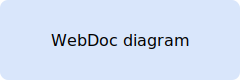
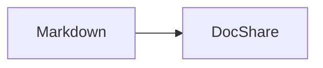

# Alpha





```mermaid
sequenceDiagram
  participant Loop as Polling loop
  participant Bot
  Loop->>Bot: run()
  loop poll
    Bot->>Bot: work
  end
  Bot-->>Loop: done
  Loop->>Bot: next
```

<script data-secret="raw-html">window.bad = true</script>

[External documentation](https://example.com/docs)
